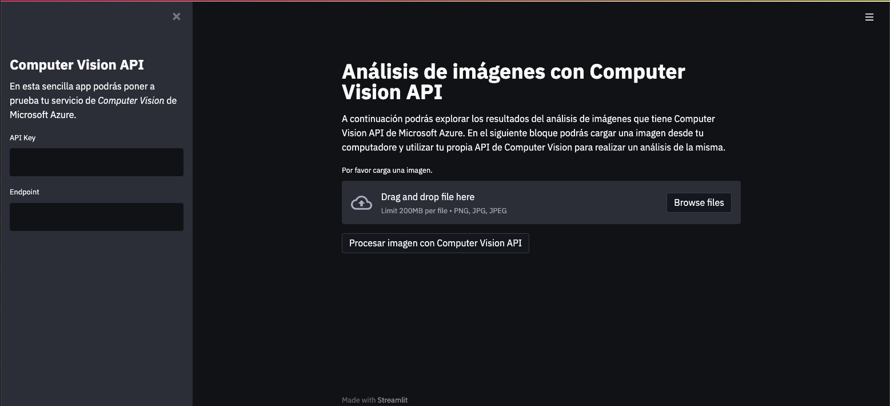
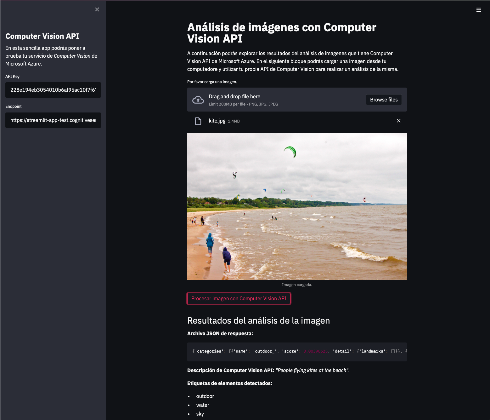

# Análisis de imágenes con Computer Vision API

En esta sencilla app podrás poner a prueba tu servicio de _Computer Vision_ de Microsoft Azure.

Sólo necesitas crear un recurso de Computer Vision desde el portal de Azure y ponerle un nombre. Una vez hayas creado el recurso, sólo necesitas agregar a la app tu _API key_ y el _Endpoint_ del recurso, así como cargar una imagen.

